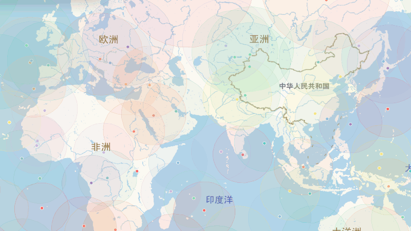

# GW Dashboard

<p align="center">
  
</p>

[](https://pypi.org/project/gw-dashboard/)
[](https://pypi.org/project/gw-dashboard/)
[](https://www.gnu.org/licenses/gpl-3.0.en.html)
[](https://github.com/NearlyHeadlessJack/gw-dashboard/actions/workflows/publish.yml)

**星网（GW）卫星星座数据仪表盘**

基于互联网公开信息，自动化收集星网/国网星座的运行与发射数据，提供可视化仪表盘和交互式地图展示。



## 功能特性

- **数据仪表盘** — 卫星与发射统计总览、制造商/火箭分布图表
- **交互式地图** — 卫星实时位置与轨迹展示，支持 LEO 覆盖范围可视化
- **轨道追踪** — 前端基于 SGP4/TLE 实时解算卫星轨道，近地点/远地点历史图表
- **自动更新** — 后台守护进程定期爬取最新 TLE 数据，无需手动干预
- **多数据库支持** — SQLite / MySQL / PostgreSQL 三种后端可选


## 快速开始

### 安装

```bash
# 从 PyPI 安装（推荐）
pip install gw-dashboard

# 或从源码安装
git clone https://github.com/NearlyHeadlessJack/gw-dashboard.git
cd gw-dashboard
uv sync
```

> 遇到安装问题？参见 [安装指南](docs/install-guide.md)，涵盖 Windows、Linux（虚拟环境 / pipx / uv）和 macOS 的详细说明。

### 运行

```bash
# PyPI 安装后直接运行
gw-dashboard

# 从源码运行
uv run -m gw

# 开发模式（启动前自动构建前端，需要 Node.js）
uv run -m gw -d
```

首次运行时，如果数据库不存在，程序会自动爬取数据并初始化，然后启动 Web 服务。控制台会打印访问 URL。

### 配置

默认无需配置文件即可运行（使用 SQLite）。如需自定义，复制示例配置：

```bash
cp config.example.yaml config.yaml
```

主要配置项：

```yaml
database:
  type: sqlite3          # sqlite3 / mysql / postgresql
  connection: database/gw.sqlite3

backend:
  host: 0.0.0.0
  port: 8000
  cache_ttl_seconds: 30

daemon:
  update_check_interval_seconds: 3600   # 数据更新检查间隔
  data_valid_duration_seconds: 86400     # 数据有效时长
```

环境变量也可覆盖配置，如 `GW_FRONTEND_DIST_DIR` 可指定前端静态文件目录。

## 项目结构

```
gw-dashboard/
├── gw/                  # 后端源码
│   ├── __main__.py      # 入口程序
│   ├── config.py        # 配置加载
│   ├── startup.py       # 启动初始化
│   ├── scraper/         # 数据爬取
│   ├── database/        # 数据库操作
│   ├── web/             # API 与静态资源
│   ├── daemon/          # 守护进程（定时更新）
│   ├── orbit/           # 轨道计算
│   └── utils/           # 工具函数
├── frontend/            # 前端源码
│   └── src/
│       ├── App.tsx      # 主应用
│       ├── api.ts       # API 调用
│       ├── orbit.ts     # 轨道解算
│       └── types.ts     # 类型定义
├── tests/               # 后端测试
├── database/            # 数据库存储目录
└── pyproject.toml       # 项目配置
```

## 技术栈

| 层级 | 技术 |
|------|------|
| 前端 | React 19 · TypeScript · Vite 8 · Leaflet · satellite.js |
| 后端 | Python ≥3.12 · FastAPI · SQLAlchemy · SGP4 |
| 包管理 | uv (后端) / npm (前端) |
| 测试 | pytest / ESLint |

## 开发

### 后端

```bash
# 安装依赖
uv sync

# 运行测试
uv run pytest

# 代码检查
uv run ruff check .
```

### 前端

```bash
cd frontend

# 安装依赖
npm install

# 开发服务器
npm run dev

# 构建
npm run build

# 代码检查
npm run lint
```

### 构建发布包

```bash
# 先构建前端
cd frontend && npm run build && cd ..

# 再构建 Python wheel
uv build
```

## 数据来源

所有数据均来自公开信息（CelesTrak、卫星百科 等），仅供学习参考。  

> Code with Codex (GPT5.5) & Claude Code (GLM5.1 / DeepSeek-V4-Pro)

## 许可证

[GPL-3.0](LICENSE)
